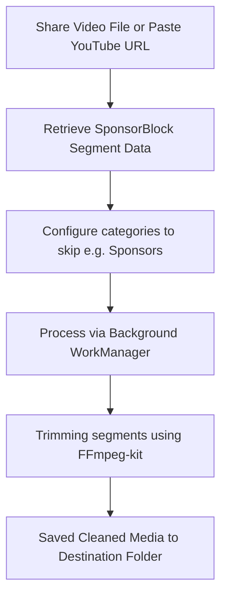

# SB Skip

[](LICENSE) [](#tech-stack)

**SB Skip** is a focused, premium, privacy-respecting Android utility designed to remove SponsorBlock-marked segments from media files you already have on your device.

Unlike streaming players or fully fledged YouTube replacements, **SB Skip** has one specialized job: accept a media file (or URL), fetch SponsorBlock community-sourced skips, trim the unwanted segments, and output a clean file with zero user friction.

---

## 🚀 Key Features

* **SponsorBlock Integration**: Fetch skip segments directly using the public community-maintained SponsorBlock API.
* **Background Queue**: Clean files asynchronously using standard Android `WorkManager` workers, even when the app is in the background.
* **Paste & Share Integration**: Intake URLs via manual copy-pasting or directly from other apps (e.g. NewPipe, browser) using the Android system Share sheet.
* **Modern Customization**: Support for HSL-curated color systems, Dynamic Material You colors, Dark/Light modes, and monochrome/adaptive system icons.
* **Precise Control**: Fine-grained configuration to choose which categories to remove (Sponsors, Self-promotion, Intros/Outros, Interaction reminders, Filler content, etc.).
* **Obfuscation Ready**: Full code shrinking and obfuscation optimization setup via Proguard/R8.
* **Fastlane Automated Bumps**: Complete versioning, building, and screenshot capture pipelines powered by Fastlane.

---

## 🛠 Tech Stack & Architecture

SB Skip is built using modern Android development best practices and robust libraries:

* **UI Engine**: Jetpack Compose with Material 3 components.
* **Architecture**: Clean MVVM with immutable state streams powered by `StateFlow` and Hilt Dependency Injection.
* **Background Engine**: Android Jetpack `WorkManager` for reliable, system-orchestrated processing.
* **Local Storage**: Jetpack DataStore Preferences (app settings) and Room DB (asynchronous download queue tracking).
* **Media Cleaning Engine**: High-performance trimming compiled with `ffmpeg-kit-lts-16kb`.
* **Networking**: Retrofit 2 + OkHttp 4 for reliable SponsorBlock server API queries.

---

## 📖 How It Works



1. **Intake**: Paste a YouTube URL or select an existing audio/video file.
2. **SponsorBlock Query**: SB Skip queries the server for timestamps of community-submitted segments.
3. **Execution**: A background worker takes the local file, coordinates with the `FFmpeg-kit` compile, and cuts the unwanted chunks.
4. **Completion**: A clean file is written to your selected directory, and a system notification is shown.

---

## 💻 Building the Project

### Prerequisites

* Android Studio (Koala or later recommended)
* JDK 17
* Android SDK (Compile SDK 35, Min SDK 26)

### Standard Gradle Commands

To compile and build the debug app package:

```bash
./gradlew assembleDebug
```

To run local Kotlin unit tests:

```bash
./gradlew test
```

### Fastlane Lanes

Fastlane is fully integrated to automate versioning and screenshots:

* **Version info**: `bundle exec fastlane android version`
* **Version code bump**: `bundle exec fastlane android increment_version_code`
* **Minor version bump**: `bundle exec fastlane android increment_minor`
* **Major version bump**: `bundle exec fastlane android increment_major`
* **Screenshots capture**: `bundle exec fastlane android screenshots` (runs instrumented test capture automatically)

---

## 📄 License

SB Skip is free software: you can redistribute it and/or modify it under the terms of the **GNU General Public License v3.0** as published by the Free Software Foundation. See the [LICENSE](LICENSE) file for more details.
