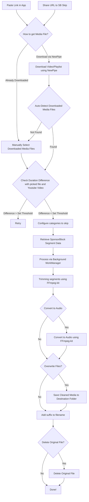

# SB Skip

[](LICENSE) [](#tech-stack) [](https://github.com/nihaltp/SBSkip/releases/latest)

**SB Skip** is a focused, privacy-respecting Android utility designed to remove SponsorBlock-marked segments from media files you already have on your device.

It is designed to work perfectly alongside **[NewPipe](https://newpipe.net/)**. While NewPipe excels at downloading videos and entire playlists, **SB Skip** takes those downloaded files, fetches SponsorBlock community-sourced skips, and trims out the unwanted segments (sponsors, intros, etc.)—leaving you with a clean file and zero friction.

---

## Download

### 1. GitHub Releases (Latest)

Download the latest APK directly from the [GitHub Releases](https://github.com/nihaltp/SBSkip/releases/latest) page.

### 2. F-Droid Repository

Available on my F-Droid repository:


**Repository URL:**

```text
https://nihaltp.github.io/fdroid/repo/
```

[Open Repo Page](https://nihaltp.github.io/fdroid/repo/) to scan the QR code.

---

## 🚀 Key Features

* **Companion to NewPipe**: Built to seamlessly process individual videos or batch-process entire downloaded playlists from NewPipe.
* **SponsorBlock Integration**: Fetch skip segments directly using the public community-maintained SponsorBlock API.
* **Broad Media Support**: Processes any audio or video file format supported by FFmpeg (e.g., MP4, MP3, Opus, WebM, MKV, etc.).
* **Background Queue**: Clean files asynchronously using standard Android `WorkManager` workers, even when the app is in the background.
* **Paste & Share Integration**: Intake video or playlist URLs via manual copy-pasting or directly from other apps using the Android system Share sheet. SB Skip automatically detects the corresponding downloaded media files (with manual selection as a fallback).
* **Modern Customization**: Support for HSL-curated color systems, Dynamic Material You colors, Dark/Light modes, and monochrome/adaptive system icons.
* **Precise Control**: Fine-grained configuration to choose which categories to remove (Sponsors, Self-promotion, Intros/Outros, Interaction reminders, Filler content, etc.).

---

## 🛠 Tech Stack & Architecture

SB Skip is built using modern Android development best practices and robust libraries:

* **UI Engine**: Jetpack Compose with Material 3 components.
* **Architecture**: Clean MVVM with immutable state streams powered by `StateFlow` and Hilt Dependency Injection.
* **Background Engine**: Android Jetpack `WorkManager` for reliable, system-orchestrated processing.
* **Local Storage**: Jetpack DataStore Preferences (app settings) and Room DB (asynchronous download queue tracking).
* **Media Cleaning Engine**: High-performance trimming compiled with `ffmpeg-kit-lts-16kb`.
* **Networking**: Retrofit 2 + OkHttp 4 for reliable SponsorBlock server API queries.

---

## 📖 How It Works


```mermaid
graph TD
    A[Paste Link in App] --> C{How to get Media File?}
    B[Share URL to SB Skip] --> C
    C --> |Download via NewPipe| D[Download Video/Playlist using NewPipe]
    C --> |Already Downloaded| E[Manually Select Downloaded Media Files]
    D --> F{Auto-Detect Downloaded Media Files}
    E --> H{Check Duration Difference with picked file and Youtube Video}
    H --> |Difference > Set Threshold| RE[Retry]
    H --> |Difference < Set Threshold| G[Configure categories to skip]
    F --> |Found| H
    F --> |Not Found| E
    G --> I[Retrieve SponsorBlock Segment Data]
    I --> J[Process via Background WorkManager]
    J --> K[Trimming segments using FFmpeg-kit]
    K --> L{Convert to Audio}
    L --> |Yes| M[Convert to Audio using FFmpeg-kit]
    L --> |No| O{Overwrite Files?}
    M --> O
    O --> |Yes| N[Save Cleaned Media to Destination Folder]
    O --> |No| P[Add suffix to filename]
    N --> P
    P --> Q{Delete Original File?}
    Q --> |Yes| R[Delete Original File]
    Q --> |No| DONE[Done!]
    R --> DONE
```

1. **Intake & Acquisition**: Share a video/playlist URL to SB Skip (or paste it in-app). From here, you can download the media using NewPipe (which SB Skip will try to auto-detect), or manually select media you've already downloaded.
2. **Configuration & Query**: Select the categories you wish to remove (e.g., Sponsors, Intros). SB Skip will fetch the required segment timestamps from the SponsorBlock API.
3. **Execution**: A background worker coordinates with `FFmpeg-kit` to seamlessly cut out the unwanted segments from your media files.
4. **Post-Processing**: Depending on your settings, SB Skip can convert the resulting video to audio and append a suffix to the final filename.
5. **Completion**: The finalized clean file is saved to your destination folder, and you have the option to automatically delete the original unedited file.

---

## 💻 Building the Project

### Prerequisites

* Android Studio (Koala or later recommended)
* JDK 17
* Android SDK (Compile SDK 35, Min SDK 26)

### Standard Gradle Commands

To compile and build the debug app package:

```bash
./gradlew assembleDebug
```

To run local Kotlin unit tests:

```bash
./gradlew test
```

---

## 📄 License

SB Skip is free software: you can redistribute it and/or modify it under the terms of the **GNU General Public License v3.0** as published by the Free Software Foundation. See the [LICENSE](LICENSE) file for more details.
