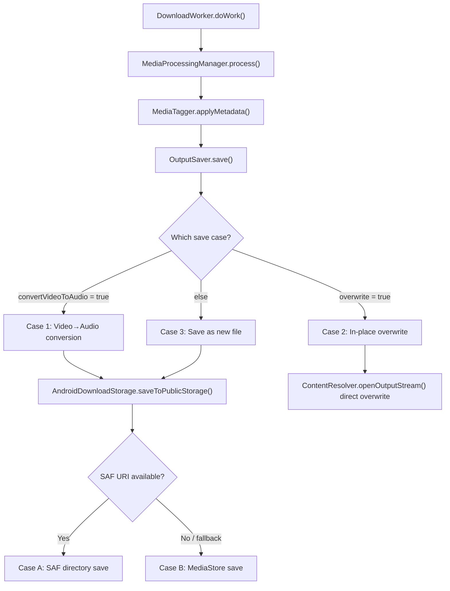

# File Saving Analysis — SBSkip

## Overview

After media is processed (SponsorBlock segment removal, video-to-audio conversion, metadata tagging), the final output file is saved by [OutputSaver.kt](app/src/main/java/com/nihaltp/sbskip/workers/helpers/OutputSaver.kt) which delegates to [AndroidDownloadStorage.kt](app/src/main/java/com/nihaltp/sbskip/storage/AndroidDownloadStorage.kt). The entire pipeline is orchestrated by [DownloadWorker.kt](app/src/main/java/com/nihaltp/sbskip/workers/DownloadWorker.kt).

---

## Pipeline Summary

---

## The Three Save Cases in OutputSaver

[OutputSaver.save()](app/src/main/java/com/nihaltp/sbskip/workers/helpers/OutputSaver.kt#L21-L93) has three distinct code paths:

### Case 1: Video-to-Audio Conversion (`item.convertVideoToAudio == true`)

**Lines:** [31–60](app/src/main/java/com/nihaltp/sbskip/workers/helpers/OutputSaver.kt#L31-L60)

**Who triggers this:**

- User checks the **"Convert to Audio"** checkbox on the main screen before tapping **Clean**, or the `defaultConvertVideoToAudio` setting is enabled globally.
- The **"Download & Clean" / "Find File"** flow when the user enables conversion in the download options dialog.
- **Watchlist auto-clean** — when a file is detected in a watchlist folder and the source file has an audio extension (`.mp3`, `.m4a`, `.aac`), `convertVideoToAudio` is set to `true` automatically.
- User picks a **video file with no YouTube URL** ("Convert Only" mode) — `isConvertOnly` forces `convertVideoToAudio = true`.

| Property | Value |
| --- | --- |
| **Extension** | `plan.outputExtension` (typically `m4a`) |
| **MediaType** | `MediaType.AUDIO` (hardcoded) |
| **Title** | `baseTitle + outputSuffix` — strips original video extension from title, appends `autoCleanSuffix` setting |
| **Output folder** | `item.audioOutputDirUri` (custom per-item) → falls back to `settings.audioFolderUri` / `settings.audioFolder` inside `saveToPublicStorage` |
| **Overwrite** | `settings.overwriteBehavior \|\| item.url.contains("overwrite=true")` |
| **Relative path** | `item.relativePath` (for watchlist subfolder nesting) |
| **Post-save** | If `item.deleteOriginalVideo == true` **and** the output file is > 0 bytes, the **original video** is deleted via `downloadStorage.deleteUri(item.localFileUri)` |

### Case 2: In-Place Overwrite (no conversion, overwrite enabled)

**Lines:** [61–70](app/src/main/java/com/nihaltp/sbskip/workers/helpers/OutputSaver.kt#L61-L70)

**Who triggers this:**

- **Default behavior** — `overwriteBehavior` defaults to `true` in [AppSettings](app/src/main/java/com/nihaltp/sbskip/model/AppSettings.kt#L20), so this is the **most common save path** for non-conversion cleans unless the user explicitly disables it in Settings.
- User taps **"Replace"** in the **conflict dialog** — this appends `overwrite=true` to the URL, which also triggers this path.
- Any URL containing `overwrite=true` as a query parameter.
- **This path is NOT used** when `convertVideoToAudio` is `true` (Case 1 takes priority).

| Property | Value |
| --- | --- |
| **Target** | The **original source file URI** (`item.localFileUri`) |
| **Method** | A safe overwrite: Writes to a `.tmp` file in cache, verifies sufficient storage capacity using `StatFs`, and only upon successful write copies the content over the original file (`ContentResolver.openOutputStream(targetUri, "wt")`). |
| **Return value** | `item.localFileUri` (same URI as input) |

> [!TIP]
> This path was historically dangerous but has been updated to use a temp-file-first strategy. If storage is full or the write fails mid-stream, the original file is no longer destroyed.

### Case 3: Save as New File (no conversion, no overwrite)

**Lines:** [71–93](app/src/main/java/com/nihaltp/sbskip/workers/helpers/OutputSaver.kt#L71-L93)

**Who triggers this:**

- User **disables** the "Overwrite original file" toggle in **Settings** (`overwriteBehavior = false`).
- User taps **"Rename"** in the **conflict dialog** — this appends `noSuffix=true` to the URL and generates a unique filename (e.g., `title_1.mp4`), which skips the overwrite path.
- Any clean where both `convertVideoToAudio` is `false` AND no overwrite flag is set.

| Property | Value |
| --- | --- |
| **Extension** | `localMetadata.extension` (preserves original) |
| **MediaType** | `item.mediaType` (preserves original — AUDIO or VIDEO) |
| **Title** | `baseTitle + outputSuffix` |
| **Output folder** | `item.audioOutputDirUri` (for audio) or `item.videoOutputDirUri` (for video) → falls back to settings if null |
| **Overwrite** | `false` (hardcoded) |
| **Relative path** | `item.relativePath` |

---

## AndroidDownloadStorage.saveToPublicStorage — The Two Sub-Paths

[saveToPublicStorage()](app/src/main/java/com/nihaltp/sbskip/storage/AndroidDownloadStorage.kt#L58-L219) resolves the destination folder and then tries two strategies:

### Sub-Path A: SAF (Storage Access Framework) Directory

**Lines:** [89–131](app/src/main/java/com/nihaltp/sbskip/storage/AndroidDownloadStorage.kt#L89-L131)

**Who triggers this:**

- User has picked a **custom output folder** via the folder picker in **Settings** (for video or audio output), which stores a `content://` SAF tree URI.
- **Watchlist files** — when a file is detected in a watchlist folder, the watchlist folder's SAF URI is passed as `customFolderUri`, so the cleaned file is saved back to the same watchlist folder (preserving subfolder structure via `relativePath`).
- The **"Download & Clean"** flow when the detected file came from a watchlist folder with a persisted SAF permission.

- **When:** `folderUriStr` is a non-empty `content://` URI and the SAF tree directory is valid
- **Process:**
  1. Navigates/creates `relativePath` subdirectories
  2. Creates a temporary `.tmp` file and writes content
  3. If an existing file with the same name exists **and** overwrite is enabled → deletes it only after new file is written
  4. Renames `.tmp` to final filename and re-queries directory for the final correct URI
  5. Returns the SAF document URI

### Sub-Path B: MediaStore Fallback

**Lines:** [134–218](app/src/main/java/com/nihaltp/sbskip/storage/AndroidDownloadStorage.kt#L134-L218)

**Who triggers this:**

- **Default / first-time users** — no custom folder is configured out of the box (`videoFolderUri` and `audioFolderUri` default to empty strings), so all saves go through MediaStore.
- Any time the SAF path **fails** (e.g., permission revoked, SD card removed, SAF directory no longer exists) — the code catches the exception and falls through to this path.
- Files not originating from a watchlist folder and where no custom folder has been set in Settings.

- **When:** SAF path fails or no SAF URI is configured
- **Process:**
  1. Determines the correct `finalFolder` based on media type and allowed directories:
     - **Video:** `Movies`, `Pictures`, `DCIM`, `Download` → falls back to **`Movies/SB Skip`**
     - **Audio:** `Music`, `Podcasts`, `Ringtones`, etc., `Download` → falls back to **`Music/SB Skip`**
  2. Selects the correct `contentUri`:
     - `MediaStore.Downloads.EXTERNAL_CONTENT_URI` (if folder is Downloads)
     - `MediaStore.Video.Media.EXTERNAL_CONTENT_URI` (video)
     - `MediaStore.Audio.Media.EXTERNAL_CONTENT_URI` (audio)
  3. Inserts new `ContentValues` entry into MediaStore with a `.tmp` display name
  4. Writes file content to the MediaStore output stream
  5. If overwrite → deletes existing MediaStore entry by `DISPLAY_NAME` and `RELATIVE_PATH` (on Android Q+)
  6. Renames the temporary MediaStore entry to the final name

---

## Default Save Locations

| Media Type | Default Folder | Default URI | Setting Keys |
| --- | --- | --- | --- |
| **Video** | `Movies/SB Skip/` | (empty — uses MediaStore) | `videoFolder`, `videoFolderUri` |
| **Audio** | `Music/SB Skip/` | (empty — uses MediaStore) | `audioFolder`, `audioFolderUri` |

Defined in [AppSettings.kt](app/src/main/java/com/nihaltp/sbskip/model/AppSettings.kt#L10-L13).

---

## Temporary Files Created During Processing

| File | Created In | Cleaned Up |
| --- | --- | --- |
| `clean_in_{id}.{ext}` | [MediaProcessingManager](app/src/main/java/com/nihaltp/sbskip/workers/helpers/MediaProcessingManager.kt#L25) | ✅ `finally` block (line 54) |
| `clean_out_{id}.{ext}` | [MediaProcessingManager](app/src/main/java/com/nihaltp/sbskip/workers/helpers/MediaProcessingManager.kt#L26) | ✅ By `DownloadWorker.finally` (line 247) |
| `{name}_tagged.{ext}` | [MediaTagger](app/src/main/java/com/nihaltp/sbskip/workers/helpers/MediaTagger.kt#L54) | ✅ On failure deleted (line 133), on success the input file is deleted and tagged replaces it (line 129) |
| `thumb_*.jpg` | [CoverArtManager](app/src/main/java/com/nihaltp/sbskip/workers/helpers/CoverArtManager.kt#L51) | ✅ `finally` block in MediaTagger (line 124) |
| `{filename}.tmp` | [AndroidDownloadStorage SAF path](app/src/main/java/com/nihaltp/sbskip/storage/AndroidDownloadStorage.kt#L109) | ✅ Renamed to final name (line 123) |
