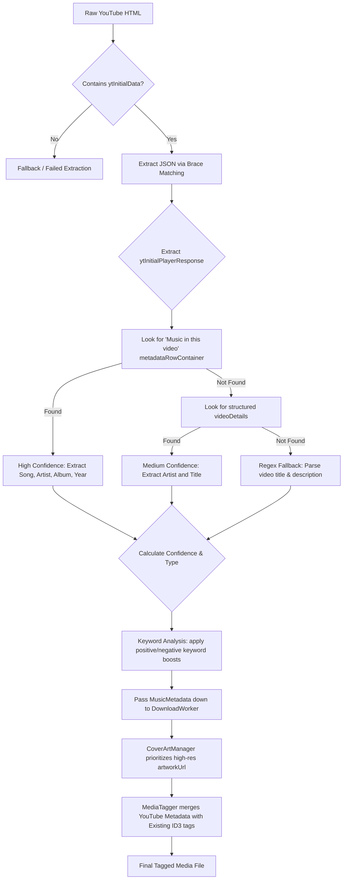

# YouTube Metadata Parsing & Tagging Architecture

This document summarizes the architectural decisions and implementation details for how SBSkip extracts music metadata directly from YouTube and applies it to downloaded media.

## 1. Scraping vs. Official API

We explicitly decided to avoid using the official YouTube Data API. This removes the need for API keys, eliminates rate-limiting concerns for users, and keeps the app self-contained. All metadata is extracted by scraping the raw HTML of the video page.

## 2. Robust JSON Extraction (`YouTubeMetadataParser`)

YouTube embeds structured data inside `script` tags in the HTML (specifically `ytInitialData` and `ytInitialPlayerResponse`).

- Instead of relying on fragile regex to extract this JSON, we implemented a robust custom brace-matching algorithm (`extractJsonObjectString`).
- This algorithm correctly handles nested objects, escaped quotes, and braces inside strings, ensuring the JSON parser doesn't crash on edge cases.
- The parser fails gracefully (returning `null`) if the page is missing this data (e.g., if a CAPTCHA page is returned) or if the JSON is malformed.

## 3. Metadata Fallback & Confidence Scoring

Extracting music details from YouTube is not always precise, so we implemented a tiered fallback mechanism with confidence scoring (`0.0f` to `1.0f`):

1. **"Music in this video" Box (Highest Confidence):** We scan the deep structure of `metadataRowContainerRenderer` to extract canonical Song, Artist, Album, and Year data.
2. **Structured Details (Medium Confidence):** We extract the artist and title from the core `videoDetails` block.
3. **Regex Fallbacks (Lower Confidence):** We fallback to parsing the raw video description and title using standard music conventions (e.g., `Artist - Title`).
4. **Keyword Classification:** We maintain lists of positive keywords (e.g., "official music video") and negative keywords (e.g., "reaction", "cover") in `Constants.kt` to accurately classify whether the video is an official track, live performance, or non-music content, heavily boosting our extraction confidence score when matched.

## 4. Intelligent Media Tagging (`MediaTagger`)

Once metadata is extracted, it is passed to the tagging layer (`MediaTagger.kt`).

- The tagger respects existing ID3 tags (using `MediaMetadataRetriever`).
- Metadata is applied in a strict priority: `Existing File Metadata` -> `YouTube Extracted MusicMetadata` -> `YouTube Basic Info` -> `Raw Filename`.
- Multi-artist tracks are preserved as lists until the final tagging step to ensure proper formatting.

## 5. High-Quality Album Artwork (`CoverArtManager`)

Standard video thumbnails often have letterboxing or text. We updated the `CoverArtManager`:

- It now prioritizes scraping the official square `artworkUrl` (if available in the metadata) over the generic video `thumbnailUrl`.
- It enforces strict download constraints: OkHttp timeouts, a 5MB maximum file size, and `image/*` Content-Type validation to ensure FFmpeg doesn't crash attempting to embed a broken/html file as cover art.

## 6. Testing Strategy

We implemented a rigorous test suite in `YouTubeMetadataParserTest.kt`:

- **Offline Synthetic Fixtures:** A `@BeforeClass` setup dynamically rebuilds `fixtures/*.html` files onto the disk before tests run. This lets us test resilient edge cases (like intentionally malformed JSON or escaped strings) without relying on the network.
- **Cleanup:** An `@AfterClass` teardown ensures the filesystem is perfectly cleaned up (deleting all test `.html` files) after the suite completes.
- **Live Integration Tests:** We use OkHttp within the test suite to download actual, current YouTube HTML pages for specific reference videos (e.g., "Blinding Lights") to ensure our parser structures remain up-to-date with YouTube's live DOM changes.

## 7. Metadata Extraction Flow

